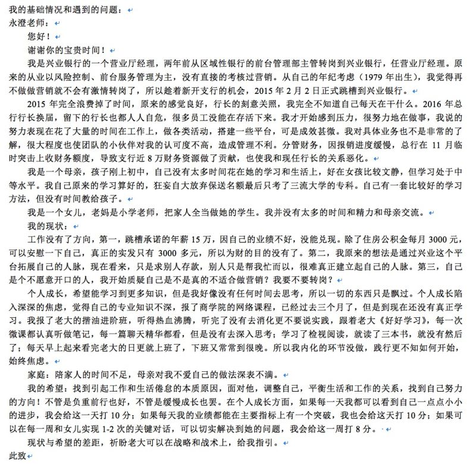
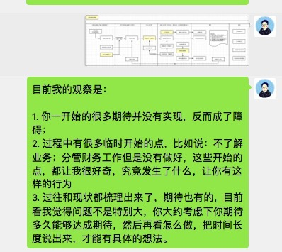
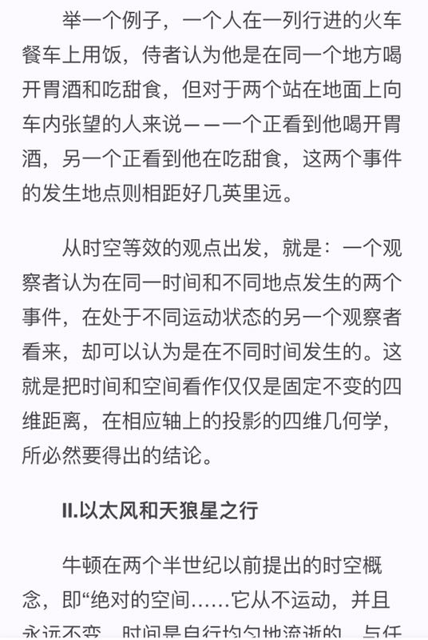

## DAY.37
+ **关键词：**咨询套路、流程树
+ **主要事件：**
    + 永澄老师的咨询套路
    + 永澄老师直播咨询案例
    
    
+ **主要语录**

感受下，这个复杂的案例怎么处理。（用流程图树立发展脉络，找到分歧点？）我完成梳理后，答案自然就出现了。

过去 -现在-未来，过去事实，当下感受问题- 未来目标

项目管理的网络图的应用，找到关键节点与之间联系。

这个思路是：

1. 个体的发展，必须要让过往和现状以及未来的关联，如果中间的关联断开，那就会导致问题的出现。
2. 很多时候，我们一心投放解决方案，但是却忘记了初心
3. 几个流程图一画，立刻看出结果来了。

永澄的高级咨询讨论，这个思路是：

1. 个体的发展，必须要让过往和现状以及未来的关联，如果中间的关联断开，那就会导致问题的出现。
2. 很多时候，我们一心投放解决方案，但是却忘记了初心
3. 几个流程图一画，立刻看出结果来了。
-----
1、注重关系与链接，从时间线上整体看，两点之间的关联，谈不清关联意味着被忽略，也意味着变化，有变化未做调整将伴随问题产生
2、提供方案要深挖原因，了解内在需求，解决内在问题，不要着急给方案
3、图表直观展示关联关系，更容易了解来访者的思维方式，找到节点关系，找到关键的精准度更高、效率更快

收获
1. 咨询过程中保持好奇心，不要太着急下结论
2. 逻辑很重要，找到个体发展各地事实与观点的时间前后链接关系，是一直能力
3. 链接的断联 产生问题的概率高
4. 关键问题 找到关键链接路
5. 图标直观，更便于沟通

最近在研究时间法则，发现其实过去是一种伪概念，在我们有限的人生中，并不存在真正的过去，至少从我自身的感觉来说，是没有截然分明的过去。比如一个人一直陷于过去，即使人存在于当下，却依然在过去打转。若一个人面向未来，即使回到过去（环境、人等，或者对过去经历总结反思），却依然可以从过去中吸收影响当下和未来的能力经验。

昨天kevin跟我说，说爱情是五维空间的两个共振能量体在四维空间的投射。所以，如果你可以在过去和将来吸取能量的话，估计，你已经升维至四维生物了

我和志勇研究到了10维空间。（10维空间是什么个概念）无限宇宙和无限可能。五维空间，时间就可以弯曲了，六维空间，时间空间就会立体了。然后把时间立体空间理解为一个点，然后延展成直线，就是7维。然后打开平面，你可以在平面无限宇宙跳跃，就是8维，如果变成立体，就是9维。

+ **一点思考**

流程图真的是个理清思路所谓好工具。如果你能用流程图把一件事情的过程做出来，那么你一定是对这个有一个清晰的脉络。